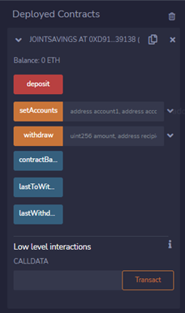
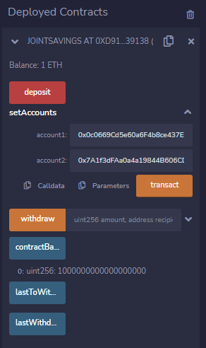
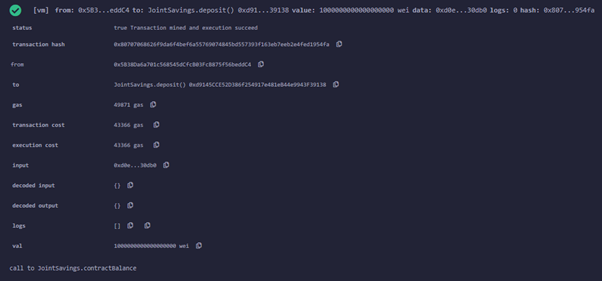
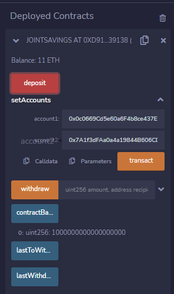
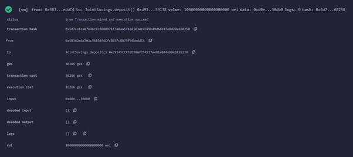
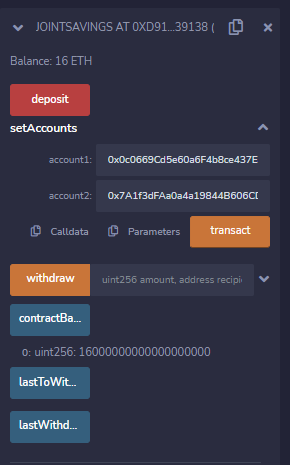
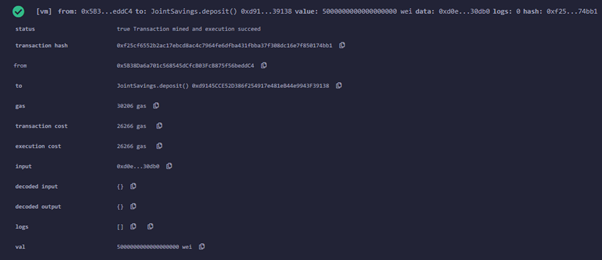
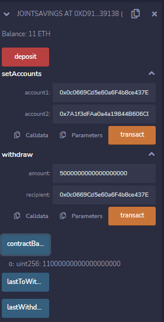
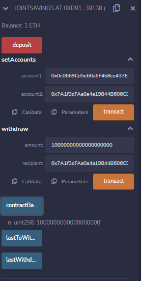
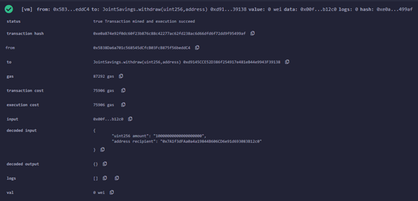

# Unit 20 - "Joint Savings Account"


### Background

A fintech startup company has recently hired you. This company is disrupting the finance industry with its own cross-border, Ethereum-compatible blockchain that connects financial institutions. Currently, the team is building smart contracts to automate many of the institutions’ financial processes and features, such as hosting joint savings accounts.

To automate the creation of joint savings accounts, you’ll create a Solidity smart contract that accepts two user addresses. These addresses will be able to control a joint savings account. Your smart contract will use ether management functions to implement a financial institution’s requirements for providing the features of the joint savings account. These features will consist of the ability to deposit and withdraw funds from the account.


### Instructions

The steps for this homework are divided into the following sections:

1. Create a Joint Savings Account Contract in Solidity

2. Compile and Deploy Your Contract in the JavaScript VM

3. Interact with Your Deployed Smart Contract


#### Results of Step 2: Compile and Deploy Your Contract



#### Results of Step 3: Interact with Your Deployed Smart Contract

Now that your contract is deployed, it’s time to test its functionality! After each step, capture a screenshot of the execution, and then save it in a folder named `Execution_Results`. You’ll share this folder with your final submission.

To interact with your deployed smart contract, complete the following steps:

1. Use the `setAccounts` function to define the authorized Ethereum address that will be able to withdraw funds from your contract.

     > **Note** You can either use the following Ethereum addresses or create new, dummy addresses on the [Vanity-ETH](https://vanity-eth.tk/) website, which includes an Ethereum vanity address generator.
    >
    > ```text
    > Dummy account1 address: 0x0c0669Cd5e60a6F4b8ce437E4a4A007093D368Cb
    > Dummy account2 address: 0x7A1f3dFAa0a4a19844B606CD6e91d693083B12c0
    > ```

2. Test the deposit functionality of your smart contract by sending the following amounts of ether. After each transaction, use the `contractBalance` function to verify that the funds were added to your contract:

    * Transaction 1: Send 1 ether as wei.

    

    


    * Transaction 2: Send 10 ether as wei.

    

    


    * Transaction 3: Send 5 ether.

    

    


    > **Note** Remembering how to convert ether to wei and vice versa can be challenging. So, you can use a website like [Ethereum Unit Converter](https://eth-converter.com/) to ease doing the conversion.

3. Once you’ve successfully deposited funds into your contract, test the contract’s withdrawal functionality by withdrawing 5 ether into `accountOne` and 10 ether into `accountTwo`. After each transaction, use the `contractBalance` function to verify that the funds were withdrawn from your contract. Also, use the `lastToWithdraw` and `lastWithdrawAmount` functions to verify that the address and amount were correct.

    * Withdraw 1: 5 ether into accountOne

    

    


    * Withdraw 2: 10 ether into accountTwo

    

    

